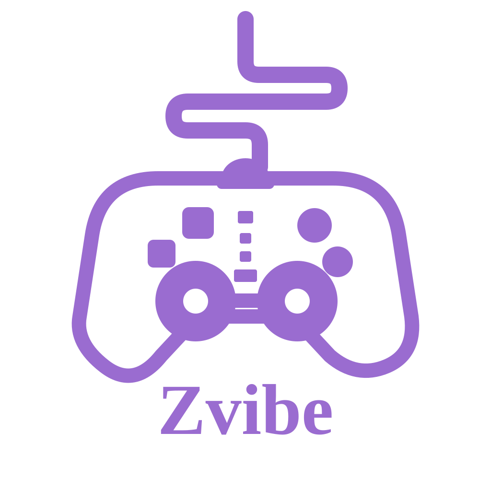
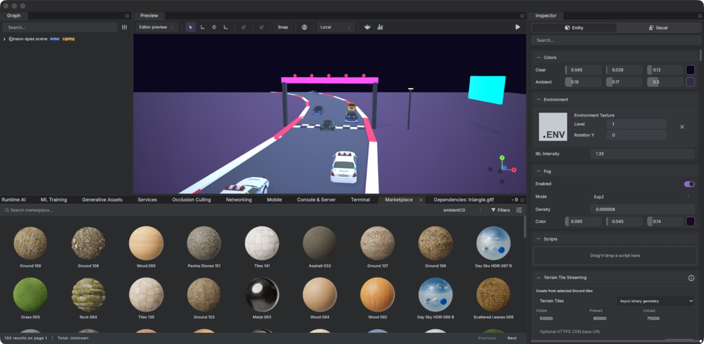
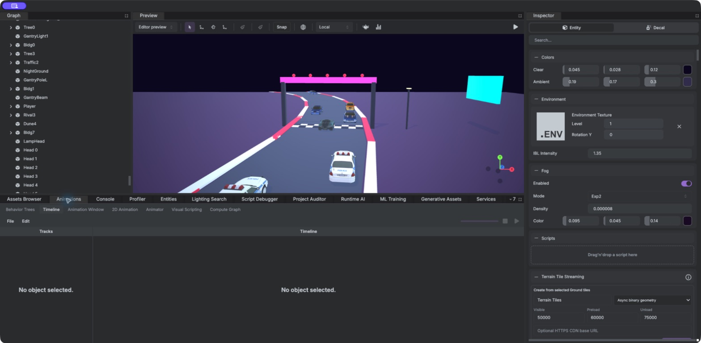
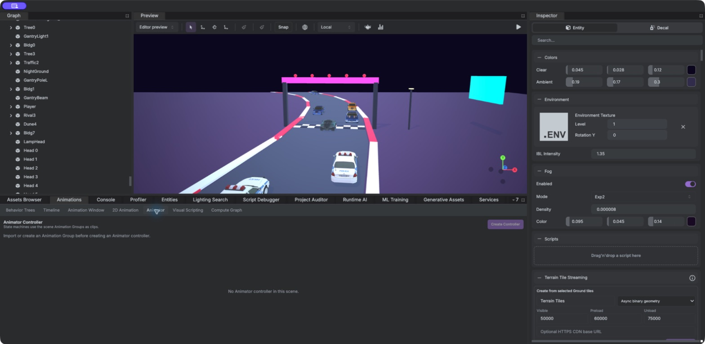
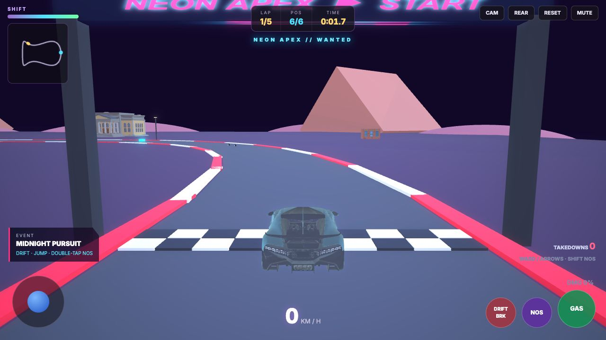
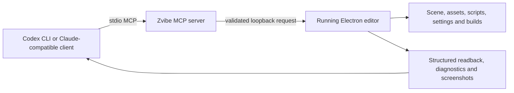

<div align="center">
  

# Zvibe Editor

### A next-generation, open-source game development environment powered by Babylon.js

[](editor/package.json)
[](LICENSE)
[](https://www.babylonjs.com/)
[](https://www.electronjs.org/)
[](https://www.typescriptlang.org/)
[](FEATURE-INVENTORY.md)

[Features](#features) · [Quick start](#quick-start) · [Tutorials](#developer-tutorials) · [MCP](#ai-native-editor-automation) · [Architecture](#repository-architecture) · [Contributing](#contributing)

</div>

Zvibe Editor is a cross-platform visual game editor for building Web, desktop, mobile, headless, XR, 2D, and 3D experiences with Babylon.js. It brings scene composition, production asset workflows, gameplay scripting, animation state machines, VFX, terrain, physics, navigation, profiling, testing, build pipelines, and AI-driven editor automation into one Electron application.

It is designed for teams that want a Unity-style visual workflow while keeping the runtime open, portable, TypeScript-first, and built on Web standards.



## Why Zvibe Editor?

- **Complete visual workflow** — compose scenes, inspect components, author assets, build gameplay, profile, and package without leaving the editor.
- **TypeScript-first runtime** — attach strongly typed scripts with lifecycle methods, decorators, scene references, and designer-editable properties.
- **AI-native by design** — Codex CLI and Claude-compatible clients can inspect and modify the live editor through 1,722 strict MCP tools.
- **Web and desktop delivery** — build Web, PWA, Electron desktop, headless, Android, and iOS project targets through reproducible Build Profiles.
- **Portable engine stack** — Babylon.js 9, WebGPU/WebGL, Havok, Recast/Detour, Electron, React, and open asset formats.
- **Open source** — the repository is licensed under Apache 2.0 and preserves attribution to the upstream Babylon.js Editor project.

## What's new in 1.1

- **Projects run this editor's own runtime.** New projects install `babylonjs-editor-tools` and `babylonjs-editor-cli` from tarballs shipped with the editor (vendored into `.zvibe/packages/`), not the upstream npm packages of the same names; opening a project reinstalls them when they differ.
- **`yarn generate` works in plain Node.** The CLI is bundled as CommonJS and the runtime's ESM build is valid for Node.
- **FFmpeg is bundled.** Audio/video export no longer needs FFmpeg on `PATH`; normalized audio keeps its source sample rate.
- **Smaller web builds.** Runtime AI (ONNX Runtime / LiteRT) is opt-in, so games that do not use it no longer ship ~64 MB of WebAssembly.
- **Stable physics.** Templates and Play mode step Havok at a fixed 60 Hz, with centimeter-scale speed limits and Audio V2 engines created by default.
- **Faster, sturdier asset pipeline.** Registry refreshes are coalesced and atomic, large folder imports/deletes take seconds instead of minutes, cinematic capture uses the correct canvas, and timed-out project tests no longer leave processes behind.
- **Orb Rush**, a complete example game built end to end through MCP, lives in [`examples/orb-rush`](examples/orb-rush).

See [CHANGELOG.md](CHANGELOG.md) for the full list and [E2E-TEST-REPORT.md](E2E-TEST-REPORT.md) for the end-to-end verification behind this release.

## Features

| Area | Production capabilities |
| --- | --- |
| Scene authoring | Hierarchy, transforms, cameras, lights, components, multi-scene workflows, prefabs, instances, command palette, undo/redo |
| Assets | Models, textures, materials, animation, audio, video, fonts, HDR/EXR, PSD/PSB, Aseprite, Alembic, FBX round trips, automatic reimport |
| Materials and rendering | PBR materials, Shader Graph/node materials, subgraphs, variants, custom passes, render graphs, rendering profiles and volumes |
| Animation and rigging | Timeline, curves, events, Animator controllers, parameters, transitions, blend trees, layers, masks, root motion, IK and rig layers |
| VFX | CPU/GPU particles, VFX/node-particle graphs, trails, collisions, events, vector fields, templates and pooling lifecycle |
| Worldbuilding | Primitives, editable geometry/ProBuilder workflows, terrain layers, vegetation, streaming tiles, splines and occlusion culling |
| Physics | Havok 3D, 2D physics, constraints, contacts, vehicles, cloth, ragdolls, force visualization and deterministic simulation controls |
| Navigation and AI | Recast NavMesh, areas, links, obstacles, crowds, agents, behavior trees/graphs, visual scripting and runtime debugging |
| 2D and UI | Sprites, sprite sheets, tile palettes, sorting layers, sprite skinning, 2D lighting, GUI editor, UI Toolkit-style UXML/USS workflows |
| Audio and cinematic | Spatial sound, SoundNodes, mixer routing, audio generation, video players, cinematic timeline, virtual cameras and capture |
| Production tooling | Script debugger, Profiler, scene tests, visual regression, device simulation, project auditor, source control and collaboration |
| Delivery | Addressables, asset streaming, localization, services, networking, runtime AI, XR, mobile tooling, Web/PWA/Electron/headless builds |

For the generated feature-by-feature status, see [FEATURE-INVENTORY.md](FEATURE-INVENTORY.md). Unity 6.5 comparison boundaries are documented in [UNITY-6-5-PARITY.md](UNITY-6-5-PARITY.md), and implementation sequencing is tracked in [ROADMAP.md](ROADMAP.md).

## Editor workspaces

Zvibe Editor exposes permanent and contextual workspaces for the systems that own project state:

- Scene Graph, Preview, Inspector, Assets Browser, Console, and Terminal
- Animation Timeline, Animator, Visual Scripting, Behavior Trees, and Compute Graph
- Shader Graph/Node Material and VFX/Node Particle editors
- Terrain, NavMesh, Cinematic, Entities, Networking, Mobile, Services, and Runtime AI
- Profiler, Script Debugger, Project Auditor, Build Profiles, Source Control, and Marketplace

<table>
  <tr>
    <td width="50%"></td>
    <td width="50%"></td>
  </tr>
  <tr>
    <td align="center"><strong>Animation Timeline</strong></td>
    <td align="center"><strong>Animator state machines</strong></td>
  </tr>
</table>

## Quick start

### Requirements

- Node.js 20 or newer
- Yarn Classic 1.22
- Git
- macOS: Xcode Command Line Tools
- Windows: Visual Studio Build Tools with Desktop C++ and the Windows SDK
- Linux: `make`, Python, and a C/C++ build toolchain

### Install, build, and launch

```bash
git clone https://github.com/byte-mods/zvibe-editor.git
cd zvibe-editor
yarn install
yarn build
yarn start
```

The packaged application identifies itself as **Zvibe Editor 1.1.0**. FFmpeg and FFprobe ship with the editor, so audio and video import/export work without a system install.

### Try the example game

[`examples/orb-rush`](examples/orb-rush) is a complete physics game — Havok bodies, 10 sounds, scripts, GUI HUD, post-processing — authored entirely through the MCP tools. Build the runtime and CLI first (`yarn build-tools && yarn build-cli`), then:

```bash
cd examples/orb-rush
yarn install
yarn dev        # play at http://localhost:3000
yarn build      # static site ready for itch.io, GitHub Pages or any static host
```

### Development loop

```bash
# Watch the editor, styles, tools, CLI, plugins, and MCP server
yarn watch-editor-all

# Run unit and integration tests
yarn test

# Check formatting and lint rules across the monorepo
yarn lint

# Build every workspace, template, and the documentation website
yarn build-all
```

## Developer tutorials

The documentation website contains 13 guided courses, 60 practical sections, real editor/game screenshots, TypeScript examples, and complete verification checklists.

Start it locally:

```bash
yarn workspace babylonjs-editor-website dev
```

Then open the [tutorial hub](http://localhost:3000/documentation/tutorials). The complete authored tutorial source is available in [tutorial-data.ts](website/src/app/documentation/tutorials/tutorial-data.ts).

| Learning path | What you build or learn | Local tutorial |
| --- | --- | --- |
| Complete IDE tour | Projects, panels, scene composition, units, saving, play mode, diagnostics | [Open](http://localhost:3000/documentation/tutorials/ide-tour) |
| Assets and materials | Importers, textures, PBR, material variants, prefabs and overrides | [Open](http://localhost:3000/documentation/tutorials/assets-materials) |
| Animation and Animator | Clips, curves, events, state machines, transitions, layers, masks and debugging | [Open](http://localhost:3000/documentation/tutorials/animation-animator) |
| TypeScript gameplay | Script lifecycle, decorators, references, input, cleanup and debugging | [Open](http://localhost:3000/documentation/tutorials/scripting-fundamentals) |
| Complete feature map | Author-test-save-build workflow across the entire IDE | [Open](http://localhost:3000/documentation/tutorials/feature-workflows) |
| Worldbuilding and physics | ProBuilder, terrain, streaming, 3D/2D physics, ragdolls, cloth and NavMesh | [Open](http://localhost:3000/documentation/tutorials/worldbuilding-physics) |
| Rendering and VFX | Lighting, Shader Graph, particles, trails, render profiles and visual profiling | [Open](http://localhost:3000/documentation/tutorials/rendering-vfx) |
| Build and publish | Editor/project settings, Web, PWA, Electron and release verification | [Open](http://localhost:3000/documentation/tutorials/build-publish) |
| Neon arcade racer | Car controller, checkpoints, rivals, nitro, HUD, lighting, audio and builds | [Open](http://localhost:3000/documentation/tutorials/racing-game) |
| Third-person action game | Character motor, Animator, camera, NavMesh enemies, combat and checkpoints | [Open](http://localhost:3000/documentation/tutorials/third-person-game) |
| 2D platformer | PNG/sprite import, tilemaps, 2D physics, animation, UI and PWA build | [Open](http://localhost:3000/documentation/tutorials/2d-platformer) |
| MCP setup | Architecture, Codex/Claude configuration, leases, safety and readback | [Open](http://localhost:3000/documentation/tutorials/mcp-guide) |
| MCP game workflow | Build, run, screenshot, diagnose, profile and package a game through MCP | [Open](http://localhost:3000/documentation/tutorials/mcp-game-workflow) |



## AI-native editor automation

The project-local MCP server lets external AI clients work through the same authoritative scene, asset, project, runtime, and UI owners used by the editor.



Current generated contract:

- **1,722 tools** across **50 feature families** and **21 editor tabs**
- Closed, bounded input schemas with read/write/destructive annotations
- Exact revision and SHA-256 fingerprint leases for stale-write protection
- Literal confirmation for destructive operations
- Atomic batches, project-contained file operations, structured diagnostics and screenshots
- Positive valid-state live-scenario coverage for every published tool

The detailed contract and verification history live in [mcp/mcp-tools-contract.md](mcp/mcp-tools-contract.md), [MCP-DEVELOPMENT.md](MCP-DEVELOPMENT.md), and [FUNCTIONALITY-VERIFICATION.md](FUNCTIONALITY-VERIFICATION.md).

### Codex CLI

The repository includes `.codex/config.toml`:

```toml
[mcp_servers.zvibe-editor]
command = "node"
args = ["mcp/server/index.mjs"]
cwd = "."
enabled = true
startup_timeout_sec = 20
tool_timeout_sec = 120
default_tools_approval_mode = "writes"
```

### Claude-compatible clients

The repository includes `.mcp.json`:

```json
{
  "mcpServers": {
    "zvibe-editor": {
      "type": "stdio",
      "command": "node",
      "args": ["mcp/server/index.mjs"]
    }
  }
}
```

Build the server before connecting a client:

```bash
yarn build-mcp-server
yarn workspace babylonjs-editor-mcp-server bundle
yarn workspace babylonjs-editor-mcp-server validate
```

Always open the target project in Zvibe Editor first. Begin with `get_editor_status`, confirm the project/scene identity, inspect current state, make a bounded write, and reread the authoritative result. Visual work should end with a screenshot; runtime work should include Play/build evidence.

## Build and package

Build Profiles cover Web, PWA, Electron desktop, headless/server, Android project scaffolds, and iOS project generation. For local editor packaging:

```bash
# Current host/architecture without signing
yarn package --noSign

# Explicit architectures
yarn package --noSign --arm64
yarn package --noSign --x64
```

Packaging ships the editor's own runtime packages and media tools next to the app:

- `yarn build` runs `yarn pack-runtime-packages`, which packs the built `tools` and `cli` into `editor/packages`. New projects vendor these tarballs, and each is stamped with a content hash (`zvibeEditorBuild`) so the editor can tell its builds apart from the upstream npm packages.
- `yarn install` copies this platform's FFmpeg and FFprobe into `editor/bin`.

Games that use Runtime AI opt in with one import, which keeps ONNX Runtime and LiteRT out of every other build:

```ts
import "babylonjs-editor-tools/runtime-ai-backends";
```

Packaging is platform-bound. Build macOS artifacts on macOS and Windows artifacts on Windows. Signed macOS releases require these environment variables in a local `.env` file:

```env
APPLE_ID=
APPLE_APP_SPECIFIC_PASSWORD=
APPLE_TEAM_ID=
```

Never commit signing credentials or `.env` files.

## Repository architecture

```text
zvibe-editor/
├── editor/       Electron main process, React renderer, inspectors and editor MCP actions
├── tools/        Runtime loading, decorators, rendering, animation and gameplay services
├── cli/          Project packing, asset processing, export and deployment helpers
├── mcp/          1,722-tool Model Context Protocol server and live verification scenarios
├── plugins/      Fab and Quixel marketplace integrations
├── templates/    Next.js, Nuxt, Solid, vanilla Web and Electron game templates
├── examples/     Complete example games (Orb Rush)
├── scripts/      Repository build helpers (runtime package packing)
└── website/      Documentation, tutorials, downloads and project website
```

The root is a Yarn Classic workspace monorepo. Babylon.js engine packages are pinned together through root `resolutions`; keep them synchronized when upgrading the engine.

## Verification

Useful release gates:

```bash
yarn format-check
yarn lint
yarn test
yarn build-all
yarn workspace babylonjs-editor-mcp-server validate
node mcp/scripts/audit-semantic-live-coverage.mjs
```

Live scenarios intentionally modify editor state and should run only against a disposable project:

```bash
yarn workspace babylonjs-editor-mcp-server all-live-scenarios
```

The latest full end-to-end pass — feature inventory, all 81 live MCP scenarios, marketplaces, and a complete game — is recorded in [E2E-TEST-REPORT.md](E2E-TEST-REPORT.md). See [FUNCTIONALITY-VERIFICATION.md](FUNCTIONALITY-VERIFICATION.md) for the distinction between contract coverage, live editor verification, packaged application checks, and manual gameplay verification.

## Contributing

Contributions are welcome.

1. Fork the repository and create a focused branch.
2. Preserve existing public APIs and editor project compatibility unless the change explicitly introduces a migration.
3. Add tests for new runtime, editor, CLI, and MCP behavior.
4. Give every new MCP capability a strict schema, safety annotations, authoritative editor implementation, readback, and live scenario.
5. Run formatting, lint, tests, and relevant production builds.
6. Open a pull request describing behavior, verification evidence, compatibility boundaries, and screenshots for UI work.

Development conventions and commands are documented in [AGENTS.md](AGENTS.md). Extension authors should also read [EDITOR-EXTENSIONS.md](EDITOR-EXTENSIONS.md).

## License and attribution

Zvibe Editor is distributed under the [Apache License 2.0](LICENSE). See [NOTICE](NOTICE) for attribution.

This project is derived from the open-source [Babylon.js Editor](https://github.com/BabylonJS/Editor). Babylon.js, Electron, Havok, Recast/Detour, and other dependencies retain their respective licenses and trademarks. Zvibe Editor does not claim API, package, serialization, service, or binary identity with Unity.

---

<div align="center">
  <strong>Build visually. Script openly. Automate safely. Ship everywhere.</strong>
</div>
